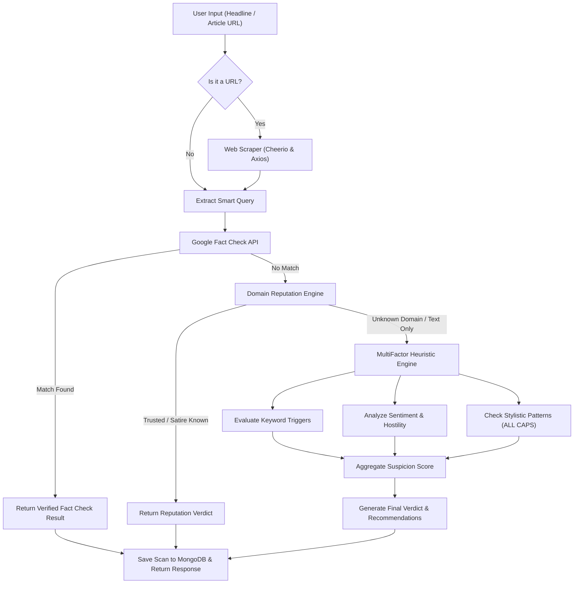

# 🕵️‍♂️ News Sherlock

> *"Unmask the truth behind every headline."*

[](LICENSE)
[](https://github.com/ArushiD4/news-sherlock/releases/tag/v1.0)
[](https://github.com/ArushiD4/news-sherlock/tree/legacy/v1)

**News Sherlock** is an automated news verification and fact-checking platform designed to combat the spread of digital misinformation. By combining authoritative fact-check registries, domain reputation heuristics, web scraping, and multi-factor NLP analysis, News Sherlock evaluates articles and headlines to provide instant, transparent, and explainable credibility verdicts.

---

## 📑 Table of Contents
- [Key Features](#-key-features)
- [How It Works (Verification Pipeline)](#-how-it-works-verification-pipeline)
- [Project Architecture](#-project-architecture)
- [Tech Stack](#-tech-stack)
- [Getting Started](#-getting-started)
  - [Prerequisites](#prerequisites)
  - [Environment Configuration](#environment-configuration)
  - [Backend Setup](#backend-setup)
  - [Frontend Setup](#frontend-setup)
- [API Reference](#-api-reference)
- [Contributing](#-contributing)
- [License](#-license)

---

## ✨ Key Features

- **🌐 Direct URL or Headline Verification:** Input a raw claim, headline, or full article URL. When a URL is provided, the integrated web scraper automatically extracts the headline and body text.
- **🔍 Multi-Tiered Verification:** Claims are evaluated against authoritative fact-checking networks (Snopes, PolitiFact, Reuters, etc.) via the Google Fact Check Tools API.
- **🛡️ Domain Reputation Engine:** Cross-references publisher domains against whitelists of established news organizations and known satire/parody sources.
- **🧠 Multi-Factor Heuristic NLP Engine:**
  - **Keyword Trigger Matching:** Evaluates content against suspicious topic clusters (conspiracy theories, clickbait patterns, fringe science).
  - **Sentiment & Tone Analysis:** Detects aggressive tone, hostile framing, or severe emotional bias.
  - **Stylistic Red Flags:** Identifies clickbait indicators such as excessive capitalization (ALL CAPS) and artificial urgency.
- **📊 Transparent Reasoning:** Delivers not just a label (*Likely Real*, *Fake / Satire*, *Fake / Suspicious*), but also a confidence score, itemized evidence points, and direct links to publisher fact-checks.
- **👤 User Authentication & Scan History:** Secure JWT-based user accounts allow users to save and revisit past verification reports.

---

## 🔬 How It Works (Verification Pipeline)



---

## 🏛️ Project Architecture

```
news-sherlock-api/
├── backend/                  # Scalable API service architecture (v2 modular layout)
│   ├── app/
│   │   ├── api/v1/           # API routes and controllers
│   │   ├── core/             # Configuration, security, and middleware
│   │   ├── db/               # Database connection and models
│   │   ├── services/         # Verification and extraction services
│   │   └── workers/          # Background tasks
│   └── tests/                # Automated backend test suites
├── verifier/                 # Modular verification core
│   ├── gates/                # Pre-flight domain, syntax, and schema gates
│   ├── extraction/           # Web scraping and claim extraction
│   ├── evidence/             # Fact-check search and proof aggregation
│   └── models/               # Heuristic and ML inference models
├── ml/                       # Machine Learning research and training
│   ├── notebooks/            # Exploratory data analysis and model experiments
│   └── data/                 # Datasets (git-ignored)
├── db/                       # v1.0 Production Backend (Express.js + MongoDB)
│   ├── config/               # Database connection logic
│   ├── data/                 # Heuristic keyword datasets & stopwords
│   ├── models/               # Mongoose schemas (User, News)
│   ├── routes/               # Express route handlers (auth, news)
│   ├── server.js             # v1 Server entry point
│   └── train_model.py        # Keyword trigger generation script
├── frontend/                 # React + Vite Single Page Application
│   ├── src/
│   │   ├── components/       # Reusable UI components (Navbar, etc.)
│   │   ├── pages/            # Views (Home, Results, History, Auth, About)
│   │   └── App.jsx           # Routing and application entry point
│   └── tailwind.config.js    # Tailwind styling system
├── docs/                     # Architectural Decision Records (ADRs) & documentation
└── .github/                  # CI/CD workflows and automated pipelines
```

> **Note on Versioning:** The stable v1.0 release is archived under tag [`v1.0`](https://github.com/ArushiD4/news-sherlock/releases/tag/v1.0) and branch [`legacy/v1`](https://github.com/ArushiD4/news-sherlock/tree/legacy/v1). Active development in `main` is expanding into a modular, production-ready v2 architecture.

---

## 🛠️ Tech Stack

- **Frontend:** React 19, Vite, React Router 7, Tailwind CSS, Framer Motion
- **Backend:** Node.js, Express 5, MongoDB (Mongoose), Cheerio, Axios, Sentiment, JWT, BcryptJS
- **Data / ML:** Python 3, Pandas, NLTK (Corpus & Stopwords analysis)
- **CI / CD:** GitHub Actions / GitLab CI

---

## 🚀 Getting Started

### Prerequisites

- [Node.js](https://nodejs.org/) (v18 or higher recommended)
- [MongoDB](https://www.mongodb.com/) (Local instance or MongoDB Atlas URI)
- [Google Fact Check Tools API Key](https://developers.google.com/fact-check/tools/api)

### Environment Configuration

Create a `.env` file in the backend directory (`db/` or root) based on [`.env.example`](.env.example):

```env
PORT=5000
MONGO_URI=mongodb+srv://<username>:<password>@cluster.mongodb.net/news-sherlock
JWT_SECRET=your_super_secret_jwt_key
GOOGLE_API_KEY=your_google_fact_check_api_key
```

### Backend Setup

1. Navigate to the backend directory:
   ```bash
   cd db
   ```
2. Install dependencies:
   ```bash
   npm install
   ```
3. Start the backend server:
   ```bash
   npm start
   # Server runs on http://localhost:5000
   ```

### Frontend Setup

1. In a new terminal, navigate to the frontend directory:
   ```bash
   cd frontend
   ```
2. Install dependencies:
   ```bash
   npm install
   ```
3. Start the Vite development server:
   ```bash
   npm run dev
   # App runs on http://localhost:5173
   ```

---

## 📡 API Reference

### News & Verification Endpoints

#### `POST /api/news/check`
Analyzes a claim, headline, or article URL.
* **Request Body:**
  ```json
  {
    "text": "Scientists discover secret alien base on the moon",
    "userId": "optional_user_id"
  }
  ```
* **Sample Response:**
  ```json
  {
    "verdict": "Fake / Suspicious",
    "confidence": 85,
    "reasons": [
      "Found high-risk keywords (2 matches)",
      "Excessive use of ALL CAPS."
    ],
    "recommendation": "High threat levels detected. Treat with caution.",
    "apiUsed": "MultiFactorEngine"
  }
  ```

#### `GET /api/news/history/:userId`
Fetches the last 20 scans performed by the given user.

---

### Authentication Endpoints

| Method | Route | Description |
|---|---|---|
| `POST` | `/api/auth/register` | Register new user account (`name`, `email`, `password`) |
| `POST` | `/api/auth/login` | Authenticate user credentials and return JWT token |

---

## 🤝 Contributing

Contributions are welcome! Please ensure you follow our workflow:
1. **Branch Naming:** Use `feature/`, `bugfix/`, or `chore/` prefixes.
2. **Pull Requests:** Direct commits to `main` are restricted; open a PR for review.
3. **Commit Conventions:** Follow structured commit messages (e.g., `feat: implement sentiment gate`).

For details, review [`CONTRIBUTING.md`](CONTRIBUTING.md).

---

## 📄 License

This project is licensed under the [MIT License](LICENSE).
